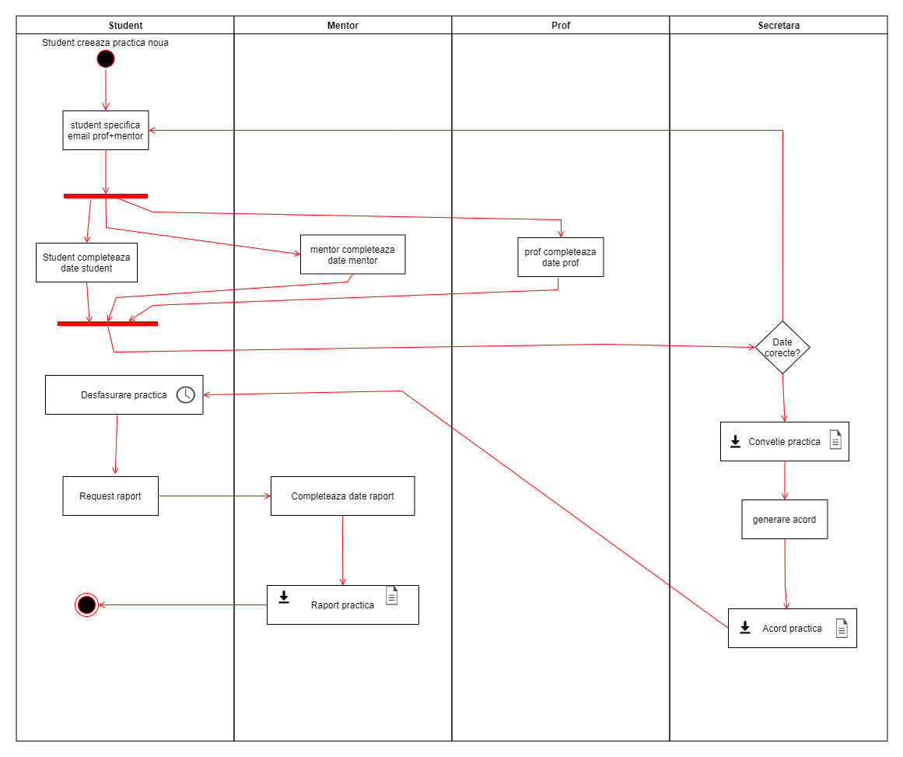

<h1> UBB Praxis Report </h1>

 This is an app for digitalizing the document flow for praxis/internships at the Babes-Bolyai University.
This app was developed during the COVID-19 pandemic, with the scope of enabling the praxis document flow without any human interactions 

 This app was developed by a group of SIA master students at the BBU:
 
Toma Sinziana: https://github.com/SinziToma
 
Tolciu Tudor: https://github.com/Tuddy18
 
Iftinca Dan: https://github.com/daniftinca

<h2> Activity Flow </h2>

